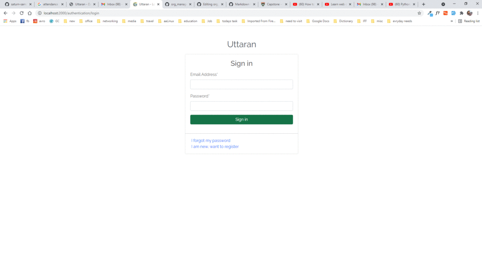

## ORG Manager
### Introduction
org_manager is an application to manage fund collection, earning, expenditure by members. It is also used to record meeting minutes and followup response on meeting agenda.
This application uses Django in backend and javascript, css, html in frontend. I named the organization "Uttaran" which means bringing up. So you may see the word uttaran in this app.

### Features
1. Used Django for backend and javascript and bootstrap 5 for frontend.
2. New member signup oppotunity and approve by admin. Inform user by mail on approval.
3. Custom User model to disable user name. Only email and password to varify user.
4. Dashboard to show all things at a glance.
5. Option to add monthly subscription fee or other subscription fee.
6. Option to add other earning information.
7. Option to add any expenditure info.
8. Approval of all info in 2,3,4 by admin.
9. Mailing subscription deposit confirmation to subscription depositing user with pdf receipt.
10. Meeting creation to add meeting minutes, Meeting attendance record of member, followup response record to any meeting agenda decision.
11. Approval of created meeting by meeting chair and mail the meeting minutes to all members.
12. Create announcement to show when a member will login to application and mail the announcement to all members.
13. show reports of Deposit, Earning, Expenditure and download reports in excel file.

### Directories and Files
- **`org_manager`** Project folder

  - **`accounting`** Accounting app and manage all accounts related info.
    - `forms.py` Contains all forms related to accounts.
    - `models.py` Contains all models related to accounts i.e. Deposit, Earning, Expenditure etc.
    - `urls.py` Contains all URL info related to accounting such as, accounts dashboard, deposit submit, deposit approve, deposit deny, deposit view, deposit report etc.
    - `views.py` Contains all view functions and classes.
  - **`authentication`** Accounting app and manage all accounts related info.
    - `admin.py` Defines admin model for custom User model with no username field.
    - `forms.py` Contains all forms for custom user such as admin user creation form, custom password change form, profile update form etc.
    - `models.py` Contains models for custom user, profile.
    - `urls.py` All URLs related to login, registration, password reset, password change etc.
    - `views.py` Defines functions for login, registration and logout.
  - **`home`** Accounting app and manage all accounts related info.
    - `urls.py` Contains index/dashboard route and profile view/edit route.
    - `views.py` Contains function for index/dashbord, profile and profile edit.
  - **`management`** Accounting app and manage all accounts related info.
    - `forms.py` Contains form for Subscription add and announcement creation.
    - `models.py` Contains Announcement model.
    - `urls.py` Contains all management/administration related URLs such as view all member, enable member, disable member, make member as admin, create/publiah/unpublish announcement, 
    - `views.py`Contains all management/administration related functions such as view all member, enable member, disable member, make member as admin, create/publiah/unpublish announcement, 
  - **`media`** Accounting app and manage all accounts related info.
    - **`pdfs`** Contains PDF of Meeting Minutes and subscription deposit receipt.
    - **`profile_pic`** Contains profile image of members.
    - **`receipt`** Contains deposit, earning, expenditure supporting documents.
  - **`meeting`** Accounting app and manage all accounts related info.
    - `forms.py` contains meeting related forms like Meeting add form, meeting agenda add form, attendance form etc.
    - `models.py` Contails models related to meeting such as MeetingType, Meeting, Agenda, Attendance
    - `urls.py` Contains meeting related URLs to perform meeting add, agenda add, attendance etc.
    - `views.py` Contains all function related to meeting.  
  - **`org_manager`** Contains settings, asgi.py, wsgi.py, main url files
  - **`static`** Accounting app and manage all accounts related info.
    - **`css`**
      - `login.css` CSS file for login and registration page
      - `style.css` Common CSS file for project
    - **`image`** Contains various logo, loader, favicon.
    - **`js`** Contains all custom javascripts for datatable and other.
    - **`logs`** Contrains all application error, warning, info logs.
    - **`vendor`** COntains all third party CSS and JS plugins I have used.
      - **`bootstrap`** Contains all bootstrap 5 framework CSS and JS.
      - **`bootstrap-multiselect`** Contains all bootstrap multiselect CSS and JS files which is responsible for multi selectable dropdown list.
      - **`datatables`** contains all CSS and JS file for bootstrap datatable plugins.
      - **`fontawesome-pro`** Contains fontawesome files.
      - **`jQuery`** Contains jquery file.
      - **`popper`** Contains popper file.
      - **`toastr`** Contains toaster files, which is used for notifications.
      - **`xdsoft`** Plugin to beautify fronend datetime formatting.
  - **`templates`** Contains all HTML templates used in this project.
  - `.gitignore` gitignore file.
  - `README.md` README file.
  - `env-file-info` .env file format to run the app.
  - `manage.py` Manage.py file.
  - `requirements.txt` python packages what is used in this applicaion.


### Procedure to Run the Application

1.  Clone Git repo. 
```shell script
git clone https://github.com/saturn-sam/org_manager.git
```
2. Change directory to project folder, and install required packages.
```shell script
cd cs50web-final-project
pip install -r requirements.txt
```
3. Create .env file with content and value as alike env-file-info.

4. Make Migration and Migrate database.
```shell script
python manage.py makemigrations
python manage.py migrate
```
5. Create Super User. Provide email and password of super user.
```shell script
python manage.py createsuperuser
```
6. Run the application
```shell script
python manage.py runserver
```

### Preview
